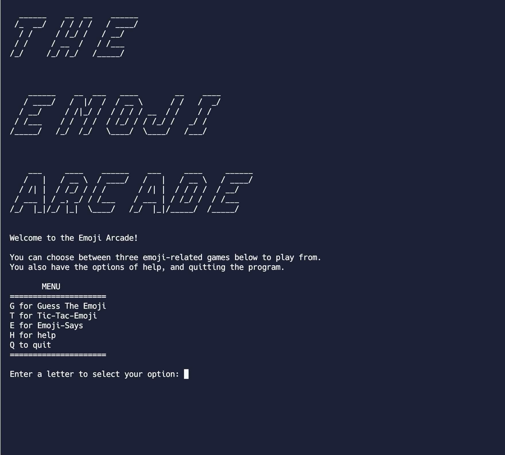
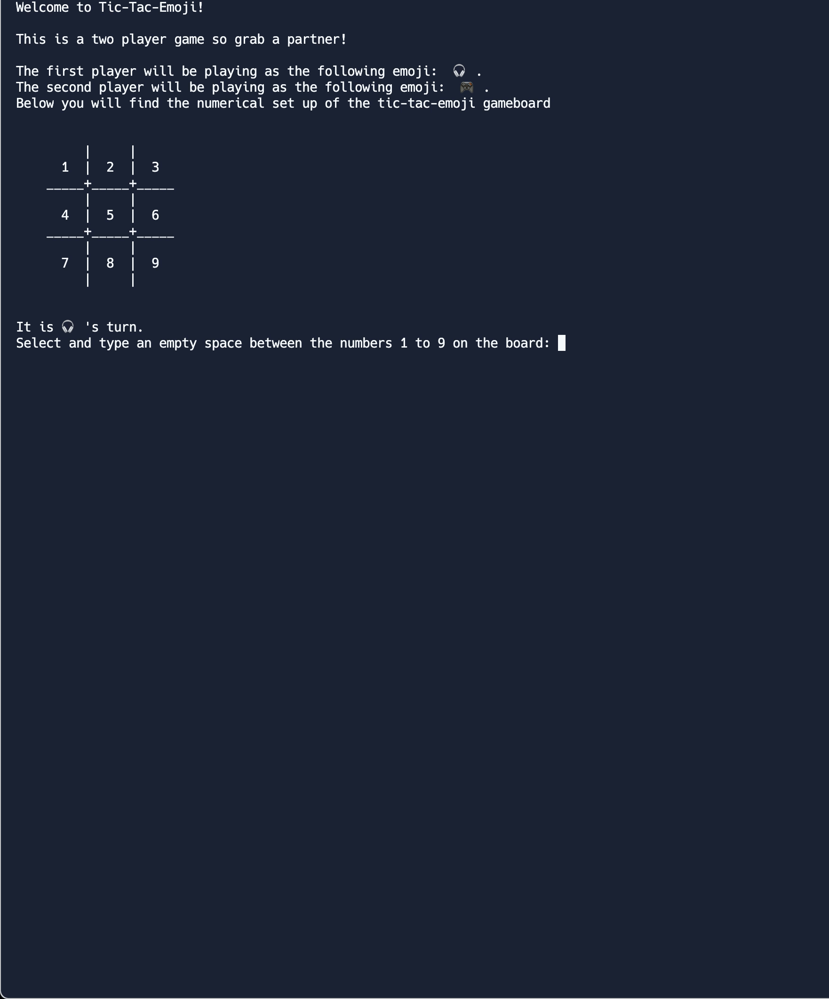
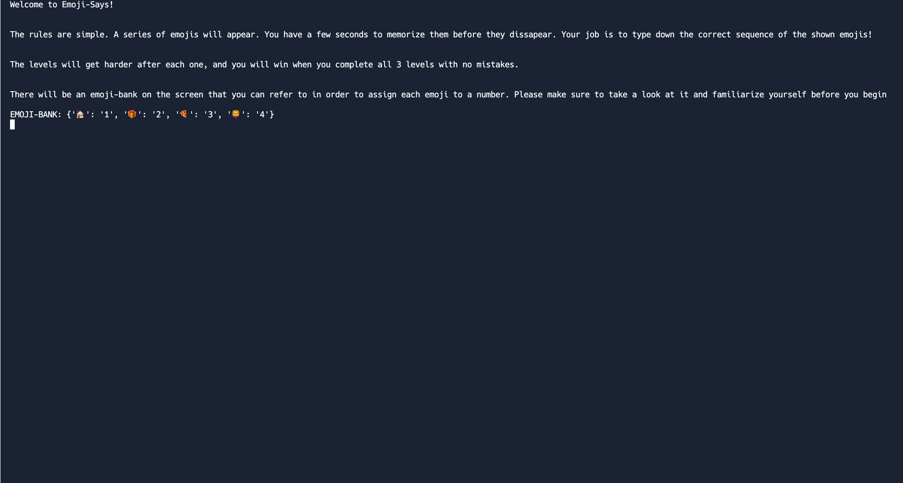

# Emoji Arcade
 
Console-based arcade game designed with Python emoji package. Includes three themed games, Pictionary, Simon Says, and two-player Tic Tac Toe. [Try it yourself!](https://replit.com/@Helenaxu924/XuEMOJIARCADEpy)

 
 ## Demo 

Emoji-Says/Pictionary game: 

Two player tic-tac-toe:

Simon says/Emoji says memorization game:

